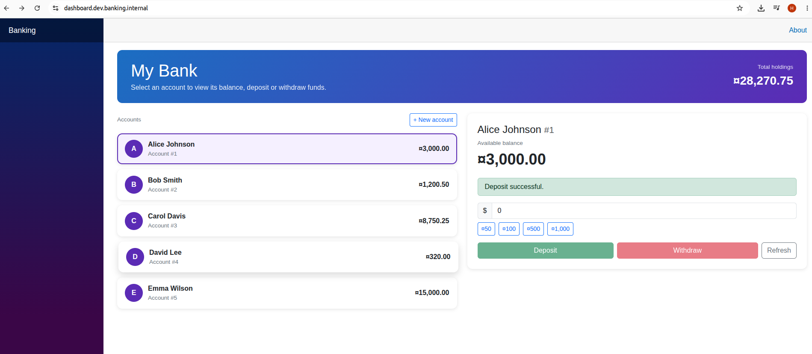
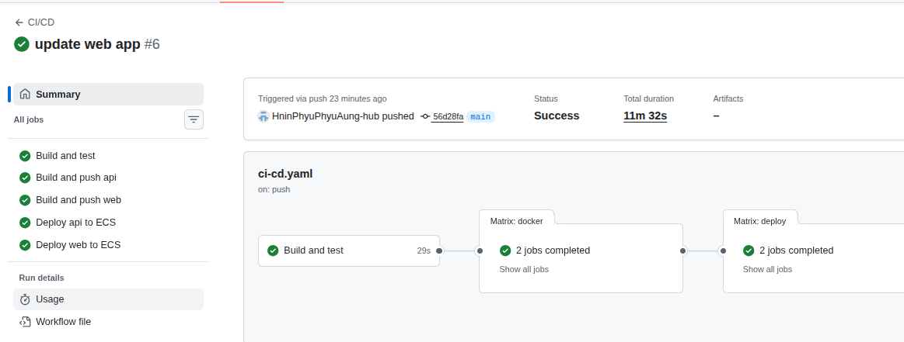

# Banking App

A small banking system: a REST API (ASP.NET Core, .NET 10, PostgreSQL) and a simple Blazor UI.

## Scope

Ship a small banking application to AWS with a fully automated pipeline — no long-lived AWS
credentials stored in GitHub, and no coupling between the application's release cycle and the
underlying infrastructure's lifecycle. This repository owns only the application code, its
containers, and the pipeline that builds, tests and deploys them. Networking, the container
registry, the database, container orchestration, load balancers, DNS, and the private certificate
authority are all owned and versioned separately in
[`banking-infra`](https://github.com/HninPhyuPhyuAung-hub/banking-infra), deployed independently
via Terraform.

## Current status

The application is deployed and reachable at the private domain `dashboard.dev.banking.internal`
(the API is at `api.dev.banking.internal`, over HTTPS signed by the environment's private CA).
It lists accounts, creates new ones, and deposits/withdraws against them, backed by PostgreSQL on
RDS via a Secrets Manager-sourced connection string:



## Features

- Get the current balance of an account
- Deposit money into an account
- Withdraw money from an account (rejects overdrafts)
- List and create accounts
- Blazor web UI with account cards, quick amounts and validation

## Project layout

```
BankingApi/   REST API (EF Core + PostgreSQL)
BankingWeb/   Blazor Server UI that calls the API
docker-compose.yaml   Local stack: Postgres + API + UI
seed.sql      Optional sample accounts
.github/workflows/ci-cd.yaml   Build, push to ECR, deploy to ECS
```

## API endpoints

| Method | Path | Description |
|---|---|---|
| GET | `/api/accounts` | List accounts |
| POST | `/api/accounts` | Create an account |
| GET | `/api/accounts/{id}/balance` | Current balance |
| POST | `/api/accounts/{id}/deposit` | Deposit `{ "amount": 100 }` |
| POST | `/api/accounts/{id}/withdraw` | Withdraw `{ "amount": 50 }` |
| GET | `/health` | Health check (used by the load balancer) |

Swagger UI is available at `/swagger`.

## Run locally

```
docker compose up -d --build
```

| Service | URL |
|---|---|
| UI | http://localhost:8081 |
| API + Swagger | http://localhost:8080/swagger |

Optional sample data (after the API has started once and created the tables):

```
Get-Content seed.sql | docker exec -i banking-postgres psql -U postgres -d banking
```

Stop everything with `docker compose down`.

## Configuration

| Setting (environment variable) | Used by | Purpose |
|---|---|---|
| `ConnectionStrings__DefaultConnection` | API | PostgreSQL connection string |
| `BankingApi__BaseUrl` | UI | Address of the API, for example `http://api:8080/` |

## CI/CD

The GitHub Actions workflow in `.github/workflows/ci-cd.yaml` triggers on pushes and pull requests
to `main` that touch `BankingApi/**`, `BankingWeb/**`, `BankingApi.slnx`, or the workflow file
itself, plus manual runs via `workflow_dispatch`.

1. **Build and test** — restores, builds and runs tests for the solution. Nothing else runs if
   this fails.
2. **Build and push** (`api`, `web` in parallel) — only after `Build and test` succeeds, and only
   outside pull requests. Builds each Docker image, authenticates to AWS via GitHub OIDC (no
   stored AWS keys), and pushes to ECR tagged with the commit SHA and `latest`.
3. **Deploy to ECS** (`api`, `web` in parallel) — only after the matching image push succeeds, and
   only on `main`. Forces a new ECS deployment for that service and waits for it to stabilize
   before the run is marked successful.

A successful run looks like this:



See [NOTES.md](NOTES.md) for prerequisites and the repository settings the pipeline needs.
